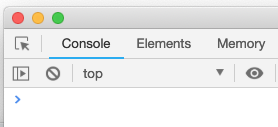
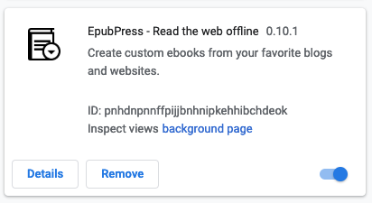
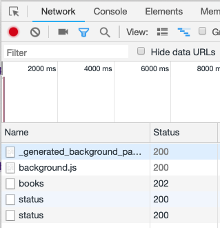
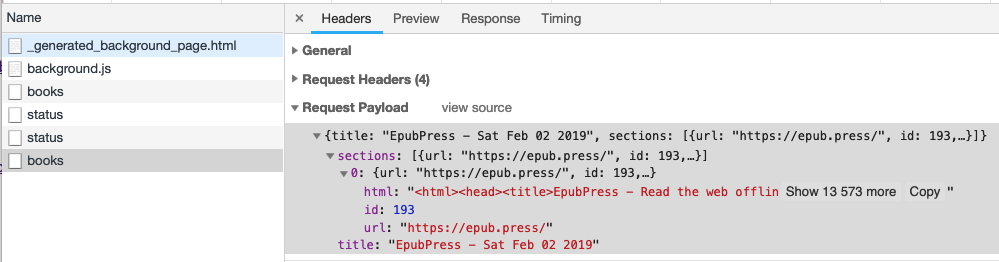

# Debugging

If you run into a bug while using EpubPress on Chrome, follow these steps to collect useful debug information.

## Checking for errors

EpubPress has two components, the popup and the background process.

**Popup Errors**

1. Open EpubPress and right-click on the popup.
1. Select `inspect`. This opens a Chrome Inspector Window.

1. Look at the `Console` tab for errors being raised or logged.  


**Background Errors**

1. Open [chrome://extensions](chrome://extensions) and enable `Developer Mode`.  

1. Find `EpubPress` and click on `Background Page`. This opens an inspector for the background process.  

1. Look at the `Console` tab for errors being raised or logged.
1. Look at the `Network` tab to check that requests are being made to the server.  

1. If a request is returning a non `2XX` status code, click on it to get more information.  

1. Run the following snippet in the `Console` to view what has been stored by the extension:
```js
chrome.storage.local.get(console.log)
```
1. Run the following snippet to reset the extension state:
```js
chrome.storage.local.set({ downloadState: false })
```
